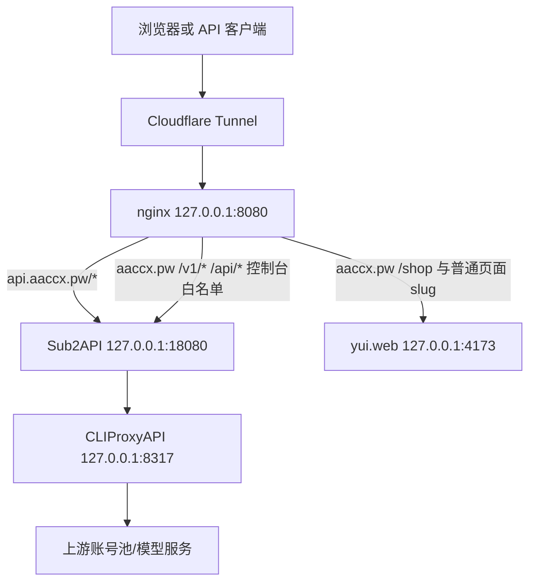

# aaccx.pw /home 路由与当前架构诊断

## 结论

当前 Mermaid 图描述的是 API 请求主链路，不是 `aaccx.pw` 全站页面路由。

真实运行态中，`aaccx.pw` 仍然是路径分流：

- `aaccx.pw/v1/*`、`/api/*`、控制台白名单路由：进入 Sub2API。
- `aaccx.pw/shop`、普通官网页面和未命中白名单的页面 slug：进入 yui.web。
- `api.aaccx.pw/*`：整体进入 Sub2API。

因此 `aaccx.pw/home` 当前不会进入 Sub2API，而是命中 nginx 的 yui.web fallback，最终返回 yui.web 404。

## 证据

- Cloudflare Tunnel 配置把 `aaccx.pw`、`www.aaccx.pw`、`api.aaccx.pw` 都转发到 `http://127.0.0.1:8080`，Tunnel 本身没有按 `/home` 做分流。
- nginx `aaccx.pw` server 中，Sub2API 页面白名单包含 `dashboard/login/register/.../admin`，但不包含 `home`。
- nginx `aaccx.pw` server 中，未命中白名单的 `/(?<slug>...)` 和 `/` 会代理到 `http://127.0.0.1:4173`，即 yui.web。
- Sub2API 自身存在 `/home` 前端路由，并且 `http://127.0.0.1:18080/home` 返回 Sub2API HTML 200。

## 实测结果

- `curl -H 'Host: aaccx.pw' http://127.0.0.1:8080/home`：HTTP 404，内容为 yui.web `404 - Page Not Found`。
- `curl http://127.0.0.1:4173/home`：HTTP 404，内容同上。
- `curl http://127.0.0.1:18080/home`：HTTP 200，内容为 Sub2API HTML。
- `curl -H 'Host: api.aaccx.pw' http://127.0.0.1:8080/home`：HTTP 200，内容为 Sub2API HTML。
- `curl https://aaccx.pw/home`：HTTP 404，内容为 yui.web `404 - Page Not Found`，外层 `server: cloudflare` 只是 Cloudflare 代理头。
- `curl https://api.aaccx.pw/home`：HTTP 200，内容为 Sub2API HTML。

## 架构含义

`aaccx.pw/home` 的问题不是 Sub2API 没有首页，也不是 CLIProxyAPI/API 主链路问题，而是 `aaccx.pw` 这个复用域名的页面路由归属没有把 `/home` 加进 Sub2API 白名单。

如果希望用户访问 `https://aaccx.pw/home` 看到 Sub2API 首页，根因修复应在 nginx `aaccx-root.conf` 的 Sub2API 页面白名单加入 `home`。如果希望 `aaccx.pw` 首页和普通页面继续由 yui.web 管理，则应避免在用户文案中公开 `aaccx.pw/home`，改用 `api.aaccx.pw/home` 或 `aaccx.pw/login` / `aaccx.pw/dashboard`。

## 图示修正建议

API 链路图可以保留，但应补一张公网入口分流图，避免误读为所有页面都进入 Sub2API。

