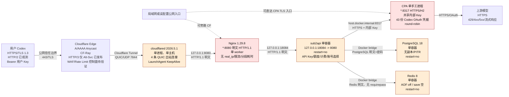
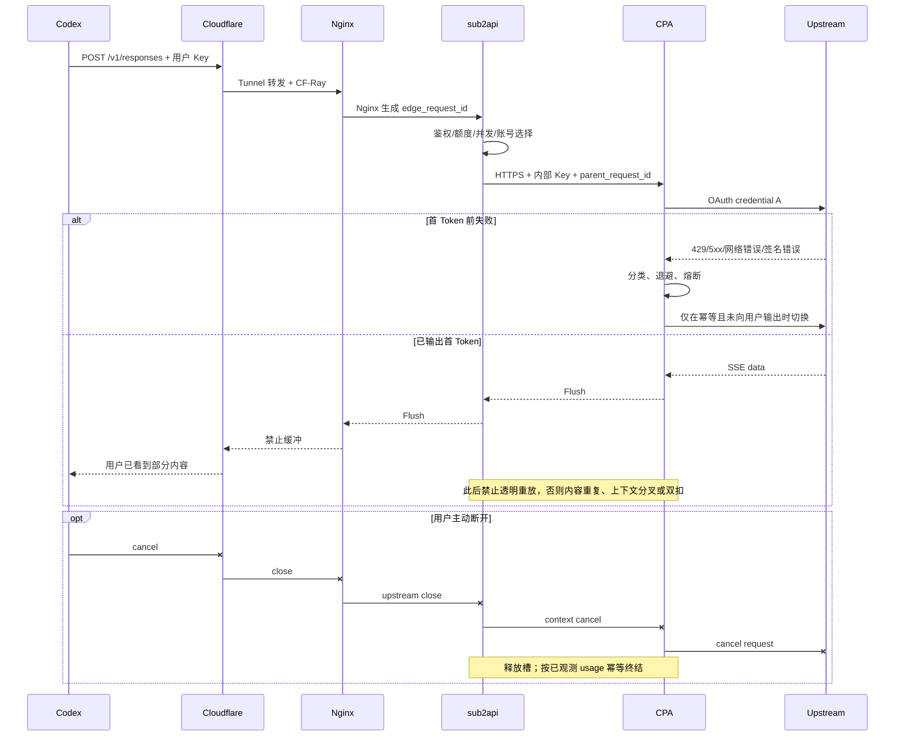
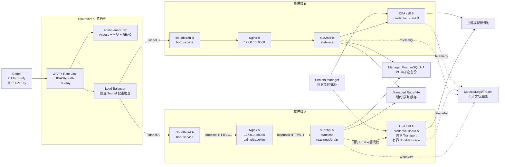

# 中转站架构优化与安全加固白皮书

> 审计对象：`Codex <-> Cloudflare <-> cloudflared/Nginx <-> sub2api <-> CLIProxyAPI（CPA） <-> 上游模型`
> 审计时间：2026-07-13，Asia/Tokyo
> 审计方式：生产环境只读取证；未修改配置、未 reload/restart、未写数据库、未清缓存、未做并发压测、未发起真实模型请求。
> 证据设计：`docs/ai/context/20260713-131622-relay-architecture-evidence-first-audit-design_CN.md`
> 取证计划：`docs/ai/context/20260713-131623-relay-architecture-evidence-first-audit-plan_CN.md`

## 1. 执行摘要

本轮首先确认了一个关键事实：当前已经使用 Cloudflare Tunnel，不应再把“引入 Tunnel”当作建议。正确问题是：Tunnel 后面的本地服务是否真正收敛为仅本机可达、Tunnel 是否有跨主机副本、内部身份和流式语义是否完整。

当前架构可以继续承载现有规模，但不具备严格生产级财务一致性、安全和高可用。最高优先级不是增加更多代理层，而是修复以下六类根因：

1. **成功输出与计费事实没有形成不可丢失原子边界。** 最近 24 小时已有 1,057 次成功转发后结算返回 `INSUFFICIENT_BALANCE`；事务回滚后没有可可靠补扣的不可变 usage fact。整个扣费任务还可能被内存队列丢弃，运行镜像的实际 overflow 配置因 dirty build 漂移无法证明。
2. **凭据仍会落盘或弱权限保存。** Nginx 默认日志会记录完整 URI，2026-07-13 仍有 Gemini `?key=` 形式的 53 字符凭据被完整写入 access log；CPA 的主配置、部分 OAuth JSON 和运行日志权限为 `0644`。
3. **Tunnel 已启用，但本地旁路面没有关闭。** Nginx 监听 `*:8080`，CPA 监听 `*:8317`，macOS 防火墙允许入站，局域网实测均可到达；公网 NAT/端口转发状态无法从本机证明，因此公网直连风险仍为待验证。
4. **所有核心组件仍在一台 8 GiB Mac 上，且自动恢复不完整。** Nginx、sub2api、CPA、PostgreSQL、Redis 和唯一 Tunnel connector 共用同一宿主机；三个容器均 `restart=no`，CPA 当前是手工进程，Nginx LaunchAgent 没有 `KeepAlive`。
5. **CPA 是当前最明显的连接与会话正确性瓶颈。** sub2api 到 CPA 只使用一把共享内部 Key，CPA 的 per-key 限制实际是全站限制；CPA 为请求新建上游 Transport，不能跨请求复用 HTTP/2 连接；round-robin 与关闭的 session affinity 会破坏 encrypted reasoning/thinking signature 所需的账号亲和性。
6. **无法稳定回答“慢在哪、为何失败、是否重试、是否扣费”。** Nginx 未记录上游分段耗时、CF-Ray 或内部 request ID；真实客户端 IP 被记为 `127.0.0.1`；sub2api 当前 `OPS_ENABLED=false`，最近 24 小时 `ops_error_logs` 无记录。

CPA 还存在一个必须在维护前核实消费者的 P0 入口：当前 `ws-auth=false`，`/v1/ws` relay 匿名开放、绕过 inbound limiter，且 WebSocket Origin 检查恒为允许；结合 `*:8317` 的 LAN 暴露，可被直接占用 FD/内存，是否有合法客户端依赖该匿名行为仍待验证。

建议的最小成本路线是保留 Cloudflare Tunnel 和现有组件，先完成监听收敛、凭据与日志治理、真实 IP/关联 ID、CPA 连接池和账号亲和性、自动拉起、数据库自动备份及蓝绿排空。真正生产级 HA 则需要两个独立故障域、受管 PostgreSQL/Redis、分区 CPA 凭据池和会话亲和、集中可观测性；不能把“同机双实例”称为高可用。

## 2. 结论标记和证据原则

- **已证实**：当前进程、监听、有效配置、源码、数据库聚合或协议探测直接支持。
- **高概率推断**：多项证据一致，但缺少 Cloudflare 控制面、路由器配置或隔离环境主动测试。
- **待验证**：需要控制面权限、维护窗口、付费模型调用、故障注入或生产压测；本轮不执行。

历史文档只用于定位待核验项，未直接作为当前事实。涉及密钥、Token、Cookie、数据库密码、OAuth 内容和私钥的命令只输出存在性、数量、权限、长度或指纹，不输出值。

风险表和事实表中的现状结论均带上述状态；正文中未显式带状态的配置、目标值和架构描述均为“建议”，不是对当前已生效能力的断言。

## 3. 已验证当前拓扑



### 3.1 当前事实基线

| 项目 | 当前事实 | 结论 |
|---|---|---|
| DNS/边缘 | `aaccx.pw` 与 `api.aaccx.pw` 解析到 Cloudflare Anycast；权威 NS 为 Cloudflare | 已证实 |
| DNSSEC | 父区无 DS、区域无 DNSKEY | 已证实，未启用 |
| 公网协议 | HTTPS 协商 TLS 1.3/HTTP/2，边缘发布 `alt-svc: h3=\":443\"`；本机客户端不支持 HTTP/3，未实际协商 | HTTP/2 已证实，HTTP/3 待验证 |
| HTTP 强制加密 | `http://api.aaccx.pw/health` 返回 200，没有跳转；HTTPS 未返回 HSTS | 已证实 |
| Tunnel | 一个 `cloudflared` 进程，当前 4 条 QUIC 连接；配置把三个 hostname 转发到 `http://127.0.0.1:8080` | 已证实 |
| Nginx | `*:8080`，macOS 防火墙允许；LAN 地址 `/health` 返回 200 | 已证实存在本地旁路 |
| sub2api | 单容器，宿主端口仅 `127.0.0.1:18084`；运行进程 UID 1000、无有效 capabilities | 已证实，容器边界相对合理 |
| CPA | 单进程，`*:8317`，TLS 1.2/1.3 与 HTTP/2；LAN 可达 | 已证实存在本地旁路 |
| 内部 TLS | sub2api 到 CPA 使用自签名证书，证书校验成功；相同 CA 已嵌入当前镜像 | 已证实，当前重建后不会丢失 |
| 数据层 | PostgreSQL/Redis 只在 Docker bridge 暴露，没有宿主机端口 | 已证实 |
| 自动恢复 | `sub2api/postgres/redis restart=no`；CPA 当前未由已加载 service 托管；Nginx LaunchAgent 无 KeepAlive | 已证实 |
| 宿主机 | macOS 15.5，8 CPU/8 GiB；Docker VM 4 GiB；数据盘 91% 使用、约 18 GiB 可用；swap 已用约 4.58 GiB | 已证实 |
| 备份 | 无 crontab/备份 service；最近可见 PostgreSQL 手工 dump 为 2026-07-11；PostgreSQL `archive_mode=off` | 已证实，无自动 PITR |
| 运行态配置漂移 | 公网实际运行 `sub2api-candidate*`，数据挂载自 2026-06-26 旧 worktree 的 candidate 目录 | 已证实 |

## 4. 分段协议表

| 跳点 | 地址与暴露面 | 实际协议/TLS | 连接复用 | 当前超时 | 缓存/缓冲 | 客户端身份来源 | 结论 |
|---|---|---|---|---|---|---|---|
| Codex -> Cloudflare | `api.aaccx.pw:443` | TLS 1.3、HTTP/2 已观测；H3 仅 Alt-Svc | Edge 管理 | 客户端配置待验证 | API 不应缓存 | 用户 Key；CF 生成 CF-Ray | 已证实/部分待验证 |
| HTTP 客户端 -> Cloudflare | `:80` | 明文 HTTP，当前直接返回 200 | Edge 管理 | Cloudflare 控制面待验证 | 不适用 | 请求可能携带明文凭据 | 已证实，高风险 |
| Cloudflare -> cloudflared | 出站 UDP 7844 | QUIC，4 条连接 | Tunnel 内建 | Cloudflare 管理 | 流式转发 | Cloudflare 控制面 | 已证实 |
| cloudflared -> Nginx | `127.0.0.1:8080` | HTTP/1.1 明文 | 默认最多 100 idle，keepalive 90s | connect 30s 默认 | 无 Edge cache 证据 | `CF-Connecting-IP` 存在，但 Nginx 未采用 | 已证实 |
| Nginx -> sub2api | `127.0.0.1:18084` | HTTP/1.1 明文 | 普通请求被无条件 `Connection: upgrade` 干扰 | connect/send 默认 60s，read 86400s | `proxy_buffering` 默认 on；应用 SSE 返回 `X-Accel-Buffering: no` | Nginx 下传 `X-Real-IP=127.0.0.1`、`X-Forwarded-Proto=http` | 已证实 |
| sub2api -> CPA | `https://host.docker.internal:8317/v1` | 自签 TLS，服务支持 H2 | sub2api Transport 复用结论见第 8 节 | 源码定义见第 8 节 | 逐段流式 | 一把共享内部 Key，最终用户身份在 CPA 边界丢失 | 已证实 |
| CPA -> 上游 | 公网 443 | HTTPS；Codex OAuth | 当前按请求创建 Transport，不能跨请求共享连接池 | 源码定义见第 8 节 | 流式 | 上游 OAuth 凭据/账号 | 已证实 |
| LAN -> CPA `/v1/ws` | `*:8317/v1/ws` | TLS/WebSocket | 长连接 | Server timeout 均为 0 | 无统一 body 上限 | 当前匿名、无 limiter、Origin 全允许 | 已证实，P0 |
| sub2api -> PostgreSQL | Docker bridge `5432` | 明文 PostgreSQL + 密码 | app pool 20 open/5 idle | statement timeout=0 | 不适用 | DB 账号 | 已证实 |
| sub2api -> Redis | Docker bridge `6379` | 明文、当前无 requirepass | app pool 64/4 idle | server timeout=0 | 内存态 | Docker 网络身份 | 已证实 |

同机 loopback/bridge 明文不自动等于 P0。当前主要威胁是监听面过宽和本地进程/容器被攻破，而不是同一内核内抓包。低成本方案应优先收敛监听和权限；跨主机方案才要求 mTLS 或受管私网 TLS。

## 5. 风险清单

严重级别定义：P0 为正在发生或已逼近硬上限的凭据、财务、未经授权资源或全站可用性风险；P1 为高概率重大故障或数据损失；P2 为中等风险和规模化瓶颈；P3 为纵深加固。

| 编号 | 证据与状态 | 级别 | 触发条件与影响 | 修复方案 | 成本 | 回滚 | 验收 |
|---|---|---:|---|---|---|---|---|
| R-00A | 成功转发后才执行 billing；流量包不足使 dedup/ledger/额度事务整体回滚。最近 24h 已有 1,057 次此类失败，现有日志不足以可靠补扣。已证实 | P0 | 用户已获得模型输出但平台没有持久 usage fact/账单，形成永久收入损失和无法对账 | 先持久化不可变 usage fact，再结算；预留估算额度，精确结算后超额进入 debt 并阻止后续请求；额度不足不得删除事实 | 高 | 新旧账务双写比对；异常时停止新消费者，fact 不回滚 | 强制余额不足后 fact 仍存在，状态为 debt/failed；重放后只结算一次；账单和 usage 可对账 |
| R-00B | 整个 `RecordUsage` 含扣费提交到内存 worker；普通请求忽略 Submit 结果。当前主线默认 overflow `sample=10%`，队列满可丢 90%；运行镜像实际值因 dirty build 待验证。源码风险已证实 | P0 | 流量峰值或 worker 阻塞时请求内容已交付，但 usage/扣费任务永久消失 | 立即显式配置 `sync`/禁止 drop；财务任务队列满时 fail-closed；长期改 PostgreSQL outbox/有界 durable queue | 中到高 | 先以 feature flag 双写；停止消费者不删除 outbox | 人工填满队列后 fact、dedup、ledger 100% 存在；drop 指标恒为 0 |
| R-00C | CPA 当前 `ws-auth=false`；`/v1/ws` 匿名、无 inbound limiter、`CheckOrigin` 恒 true。已证实 | P0 | LAN 或被误暴露公网的客户端可匿名建立长连接，耗尽 FD/内存，并绕过统一入口控制 | 先盘点合法消费者，再启用 ws-auth；独立连接限制、Origin allowlist；CPA 入口收敛到 Docker/loopback 边界 | 低到中 | 短期恢复开关并用防火墙只允许已知来源 | 匿名握手 401、超限 429、非允许 Origin 拒绝；合法 relay 正常 |
| R-01 | Nginx access log 默认记录完整 query；2026-07-13 仍有 12 次 53 字符 `?key=` 凭据落盘，日志 `0644`。已证实 | P0 | 本地低权限用户、恶意软件、备份或日志外传可复用用户 Key | 日志改用 `$uri`，禁止 `$request/$request_uri`；收紧 `0600/0640`、轮转；清点并轮换已落盘 Key；Gemini 客户端优先 `x-goog-api-key` Header | 低到中 | 恢复旧 log format；Key 轮换不可回滚，只能重新签发 | 新日志不含 query；秘密扫描为 0；旧 Key 失效，新 Key 请求正常 |
| R-02 | CPA `config.yaml=0644`，43 份 OAuth JSON 中 11 份 `0644`，5 份含非运行必需 password 字段；日志 `0644`。已证实 | P0 | 本地账号/恶意进程读取后可接管上游额度或账号 | 配置/凭据目录 `0700`、文件 `0600`；删除 password 等非运行字段；将长期秘密迁移 Keychain/Secrets Manager；轮换已暴露凭据 | 中 | 保留加密备份，恢复文件权限与上一版配置 | 权限检查通过；CPA 无 password 字段；轮换后健康和无费用鉴权探针正常 |
| R-03 | Nginx `*:8080`、CPA `*:8317`，防火墙允许，LAN 实测可达。已证实；公网 NAT 待验证 | P1 | 局域网入侵、恶意应用或路由器端口转发绕过 CF/WAF | Nginx 绑定 `127.0.0.1:8080`；CPA 容器化进同一 bridge，或只允许 Docker Desktop host gateway/loopback；阻断其它入站 | 低到中 | 恢复监听和防火墙规则 | Tunnel/公网 health 正常；LAN 8080/8317 失败；Docker 内 sub2api 到 CPA 正常 |
| R-04 | 公网 HTTP 返回 200，未强制 HTTPS，HSTS 缺失。已证实 | P1 | 用户误配 `http://` 时 Key/Prompt 可被链路窃听或降级 | Cloudflare 启用 Always Use HTTPS；确认全子域 HTTPS 后分阶段启用 HSTS，暂不 preload | 低 | 关闭 Always Use HTTPS；HSTS 先用短 max-age，回滚为 max-age=0 | HTTP 301/308；HTTPS 有 STS；所有业务子域无混合内容/证书异常 |
| R-05 | 所有核心组件和数据在单台 Mac；容器 `restart=no`、CPA 手工进程、Nginx 无 KeepAlive。已证实 | P1 | 任一进程、Docker Desktop、宿主机、电源、磁盘或网络故障导致全站中断 | 24h 内补齐进程托管和 restart policy；7-30 天做蓝绿；生产级采用跨主机 cell | 中到高 | 恢复旧 service/compose；保留旧容器和镜像 | 隔离环境 kill 单进程后自动恢复；公网发布时旧流不中断；第二主机故障切换达 RTO |
| R-06 | CPA round-robin、session affinity 关闭，thinking signature 分类遗漏直接错误码/解密文案。已证实 | P1 | 带 encrypted reasoning 的会话切换 OAuth 账号，产生 `thinking_signature_invalid`，客户端见模糊 502 | 按会话/response lineage 绑定上游凭据；匹配结构化错误码；只在首 Token 前清理或切换；首 Token 后明确终止 | 中到高 | 关闭亲和特性并恢复旧路由；保留新错误分类 | 同一会话稳定命中同一 credential；故障注入不重复内容、不双扣；错误码可辨识 |
| R-07 | CPA 每请求创建 uTLS Transport，不能跨请求复用 H2；快照约 234/256 FD、约 173 条 ESTABLISHED。已证实 | P0 | 少量增长即可触发 EMFILE、请求随机失败、TLS 握手放大和长流中断 | 按 credential/proxy/TLS 指纹缓存共享 Transport；限制 idle/host；关闭响应体；service 显式 nofile >=4096 | 中 | 特性开关切回旧 Transport；保留连接池指标 | 100 并发隔离压测时 FD进入平台并在空闲后回落，H2 确认复用，无 EMFILE |
| R-08 | CPA request ID 仅 8 hex；约 13.51 万事件中已有 3 个跨月份重复。已证实 | P2 | 追踪串线；若未来下游误把该字段单独作幂等键，会发生误去重 | 改 UUIDv7/128-bit；幂等键使用 provider+account+request+usage terminal 的复合域 | 低到中 | 双写旧/新 ID，消费者回退旧字段 | 碰撞测试通过；历史消费者兼容；账单去重不依赖 32-bit ID |
| R-09 | Nginx 无 CF-Ray/request ID/上游耗时；真实 IP 为 127.0.0.1；sub2api OPS 关闭且错误表 24h 为 0。已证实 | P1 | 无法区分 CF、Nginx、额度、排队、CPA 和上游故障，恢复时间长 | 先上无正文结构化日志和统一关联 ID，再上低基数 metrics/trace；恢复真实 IP 前先关闭旁路 | 中 | 切回旧日志格式；metrics 可独立关闭 | 单次合成请求可串联五层 ID；能回答 TTFT、重试、终态和扣费 |
| R-10 | CPA usage queue 无界、单 worker，实时同步单条可阻塞；细节见第 8 节。已证实 | P1 | 下游同步故障时内存增长、usage 延迟或进程崩溃，可能漏扣 | 有界队列+磁盘/PostgreSQL outbox；幂等消费；队列满时告警并按策略 fail-closed | 中 | 回退同步模式；保留 outbox 重放工具 | 断开消费端后内存有界；恢复后无丢失/重复扣费 |
| R-11 | Redis `appendonly=no`、`save` 为空、`restart=no`，上次保存后已有大量变更。已证实 | P1 | Redis 或 Docker 重启后并发槽、限流、缓存和调度快照全部丢失 | 明确哪些键可重建；关键状态放 DB/outbox；需要保留的键启用 AOF everysec；设置 restart policy | 中 | 关闭 AOF并从 DB 重建；保留变更前 RDB | 隔离环境重启后关键状态一致；无永久槽泄漏或额度绕过 |
| R-12 | PostgreSQL 单实例、无 archive/PITR、无自动备份；最近手工 dump 距审计约两天。已证实 | P1 | 磁盘损坏/误操作导致 RPO 以天计，恢复时间不可预测 | 每日全量+持续 WAL/至少 15 分钟增量，age/KMS 加密并异地；每月自动恢复演练 | 中 | 停止新备份任务，不删除旧备份 | 隔离恢复成功；校验 migration、关键表和账单去重；RPO/RTO 达标 |
| R-13 | 数据盘 91%，Docker 有大量可回收镜像/构建缓存；Nginx access log 约 197 MiB 且无轮转。已证实 | P1 | 磁盘满导致 PostgreSQL 写失败、容器崩溃、日志丢失 | 先备份再经授权清理无用 cache/image；日志轮转；磁盘 80/90% 告警 | 低 | 不自动删除数据；仅恢复必要镜像 | 空间低于 80%；轮转可重开日志；DB health 和备份完整 |
| R-14 | 运行态使用旧 worktree candidate 数据目录；构建允许 dirty worktree，镜像标签只写 HEAD SHA且未传 COMMIT；配置散落于 Homebrew、用户目录和手工命令。已证实 | P1 | 标签与实际二进制/config 不一致，重建时路径、证书、env 或默认值漂移，难以复现和回滚 | 禁止 dirty production build；建立版本化部署清单；镜像按 digest+SBOM；配置 checksum 和 `validate` gate | 中 | 保留当前运行清单和旧镜像；一键切回 | 镜像能证明 commit+dirty=false+config hash；新机器可复现；drift 检查为 0 |
| R-15 | Nginx 单 worker、1024 worker connections、普通请求无条件 Upgrade、无分层 timeout/limit。已证实 | P2 | 并发提升后连接上限、连接复用和慢客户端互相影响 | `worker_processes auto`、4096 connections、按需 Upgrade、upstream keepalive、按路径 timeout/limit | 低 | `nginx -t` 失败不 reload；保留备份配置 | 现有流不断；连接复用和分段耗时可见；边界压测在隔离环境通过 |
| R-16 | Cloudflare 官方默认 Proxy Read 120s/Idle 900s，Nginx read 86400s；流式首响应/心跳预算未统一。已证实 | P2 | 外层已断开但内层继续消耗上游；长静默流被 524/520/客户端超时截断 | 明确首响应、idle heartbeat、总时长预算；仅在验证 Codex 兼容后发送 SSE comment heartbeat | 中 | 关闭 heartbeat；恢复上一组 timeout | 无 Token 静默场景在测试环境按预期终止；取消后资源及时释放 |
| R-17 | 自签叶子证书有效 10 年并直接嵌入镜像信任，轮换需同时更新 CPA 与 sub2api 镜像。已证实 | P2 | 证书泄漏或轮换失配造成内部 502 | 建内部 CA，短期 leaf，双 CA/双证书重叠轮换，30/7 天到期告警 | 中 | 保留旧 CA 到过渡完成 | 新旧证书重叠期均可验证；旧证书撤销后连接失败符合预期 |
| R-18 | Docker 容器无 memory/CPU/PID 限制、rootfs 可写；但业务进程实际非 root 且 capabilities=0。已证实 | P2 | 内存泄漏或日志增长拖垮整台宿主机 | 设置资源限额、只读 rootfs、tmpfs、no-new-privileges；保留必要数据卷 | 中 | 移除单项限制并重建 | 正常流量无 OOM；越界被单容器限制；写路径清单完整 |
| R-19 | Cloudflare WAF/Rate Limiting/Access/Load Balancer 控制面不可见；官方 rate counter 按 colo，不是全局精确计费闸门。待验证 | P2 | 误以为 CF 已保护或把边缘限流当额度控制，导致刷量穿透 | 导出并版本化 CF rules；CF 只做粗粒度防刷，最终用户/额度限制留在 sub2api | 低到中 | 规则分阶段发布，保留 bypass/disable | 控制面导出可审计；NAT 用户误伤率可接受；账单上限不依赖 CF |
| R-20 | 只有一个 Tunnel connector 进程；四连接只防单连接/单边缘节点故障。已证实 | P2 | Mac、用户会话或本地网络故障导致四条连接同时消失 | 低成本在第二主机部署同 Tunnel replica；生产级用独立 Tunnel+LB 健康检查 | 中到高 | 删除新 replica/pool，不影响旧 connector | 单主机断开时新请求在目标 RTO 内切换；当前流允许失败但不重复 |
| R-21 | DNSSEC 未启用。已证实 | P3 | DNS 劫持/伪造缺少链路验证 | Cloudflare 开启签名，按注册商流程添加 DS，严格等待 TTL | 低 | 先删 DS，等待 TTL 后再关 zone signing | `dig +dnssec` 验证 AD/DS/DNSKEY，全球解析正常 |
| R-22 | cloudflared 当前 2026.5.1，`--no-autoupdate`；审计时最新稳定版为 2026.7.1。已证实 | P3 | 长期不升级积累兼容和安全风险 | 保持禁止自动热更，但建立月度测试和受控升级窗口 | 低 | 版本包回退 | 两个 replica 轮换升级，活跃请求不受影响 |
| R-23 | 上游 `ResponseHeaderTimeout=0`、TLS handshake timeout 未设、client 无总期限；请求使用 `context.WithoutCancel` 且无 deadline。已证实 | P1 | 客户端/CF 已断开后，上游仍可长期占用连接、账号槽和费用；首响应可无限等待 | 上游使用原 request context+明确 deadline；billing/outbox 才使用独立短 context；dial/TLS/首响应/idle/总时长分开 | 中 | 特性开关恢复旧 context；保留 hard cap 监控 | 客户端断开后 2-5s 内上游取消；首响应超时可分类；无 goroutine/槽泄漏 |
| R-24 | sub2api SSE idle 180s、keepalive 10s，但单行允许 500MB。已证实 | P1 | 恶意/异常上游单行导致巨大内存分配或 OOM | 单行降至 8-16MB；按事件增量解析；超过上限分类终止 | 低到中 | 临时提高上限，不恢复 500MB | 超大单行测试被有界拒绝，正常 SSE/图片不受影响 |
| R-25 | sub2api 与 CPA 的现有 health 都是静态存活响应，不检查 DB/Redis/CPA/OAuth pool；没有独立 readiness。已证实 | P1 | 依赖已坏但 Tunnel/LB 继续送流量，发布过早切流 | 两层都拆 `/livez` 与 `/readyz`；ready 使用无模型费用的依赖/凭据池检查 | 低到中 | LB 暂回旧 health，保留新端点 | 依赖故障时 live=200、ready=503；恢复后自动 ready |
| R-26 | billing dedup/扣费与 usage 明细分两次写入，已观察到 dedup 无 usage；client retry 没有稳定 Idempotency-Key。已证实 | P1 | 明细缺失、同一客户端重试可能重复扣费，审计不可闭环 | usage fact/dedup/账务状态同事务；支持 `(api_key_id, Idempotency-Key)` + payload hash | 中到高 | 双写/只读校验后再切唯一约束 | 相同 key+相同 payload 返回同结果；不同 payload 冲突；无 dedup orphan |
| R-27 | `request_type=4(cyber)` 已在代码使用，但当前分支迁移约束仍为 0..3；运行库/镜像存在 schema drift。已证实 | P1 | cyber usage 插入失败，导致明细或计费链异常 | 新增只向前迁移扩为 0..4；启动时 schema capability check | 低 | 新约束可继续兼容 0..3；无需降级 | migration 后 type 4 插入/查询成功，旧类型无回归 |
| R-28 | CPA HTTP Server 的 ReadHeader/Read/Write/Idle timeout 均为 0；裸 Dial/TLS 无 context deadline；请求体和 zstd 解压无统一上限。已证实 | P1 | slowloris、压缩炸弹、半开连接或上游握手卡死耗尽 FD/内存 | ReadHeader/Idle timeout；流式保持 WriteTimeout=0；Dial/TLS 5-10s；压缩前后 body 上限 | 中 | 单项配置恢复旧值 | slowloris 被断开，超限返回 413，正常 SSE/图片不受影响 |
| R-29 | CPA request-log 默认关闭但错误请求仍强制落盘；<=1MiB 请求体和错误响应体可保存，Cookie 不在 Header 遮盖表，日志创建为 0644。已证实 | P1 | Prompt、代码、Cookie、OAuth 响应或错误正文进入磁盘/备份 | 错误日志改字段 allowlist；正文默认不落盘；Cookie/Set-Cookie 全遮盖；日志 0600 与短保留 | 低到中 | 临时提高特定 debug 采样，仅用合成数据 | 生产秘密扫描为 0；错误仍保留 code/phase/request ID |
| R-30 | sub2api `GetClientIP` 无条件信任 `CF-Connecting-IP`，而 Nginx/CPA 仍有 LAN 旁路。已证实 | P1 | 旁路客户端伪造 IP，绕过未来按 IP 限流和污染审计 | 关闭旁路；Nginx 覆盖转发头；应用只对固定 proxy CIDR 信任 Header | 低 | 恢复旧解析但保留 listener 限制 | LAN 伪造头无效；公网记录真实客户端 IP |

## 6. 网络安全与隔离

### 6.1 Cloudflare 到源站

当前使用的是 Tunnel 正向出站模型，不是 Cloudflare 公网 IP 直接访问源站。因此“只允许 Cloudflare 公网 IP 段访问 Nginx”不是当前最合适的控制；正确控制是 Nginx 只监听 loopback，并在主机/路由器上关闭所有不需要的入站。

Cloudflare 官方说明 Tunnel 可在防火墙阻断全部 ingress 的同时，仅允许 `cloudflared` 通过 TCP/UDP 7844 出站。当前 Tunnel 已满足“从本机主动连出”，但 Nginx 和 CPA 的 wildcard listener 重新引入了旁路面：

- `[已证实]` LAN 可直接访问 Nginx，绕过 Cloudflare 的 WAF、Rate Limiting、TLS 和 CF-Ray。
- `[已证实]` LAN 可直接完成 CPA TLS/H2 握手，绕过 sub2api 的用户鉴权、套餐、额度和审计；CPA 自身仍有内部 Key，但入口面不应对 LAN 开放。
- `[待验证]` 路由器是否存在 NAT/UPnP/端口转发。没有证据时不能声称公网真实源站已经绝对隐藏。

建议顺序必须是：先验证 Tunnel health 和回滚路径，再收敛 Nginx 到 `127.0.0.1`；CPA 不能直接照搬 loopback，因为 Docker Desktop 容器通过 `host.docker.internal` 访问宿主机，需先容器化 CPA 或建立只允许 Docker host gateway 的规则。

### 6.2 本地明文链路是否需要 mTLS

| 链路 | 单机建议 | 跨主机建议 | 原因 |
|---|---|---|---|
| cloudflared -> Nginx | loopback HTTP 足够 | 若跨主机则 TLS/mTLS | 同机加 TLS不能防 root/同用户进程，监听收敛收益更大 |
| Nginx -> sub2api | loopback HTTP 足够 | 私网 TLS/mTLS | 当前 Docker 端口只绑定 127.0.0.1，边界已窄 |
| sub2api -> CPA | 保留当前 TLS+内部 Key，并收敛监听 | mTLS 或工作负载身份 | 该跳跨 Docker host gateway，TLS有实际价值 |
| sub2api -> PostgreSQL/Redis | 同一专用 bridge 可明文 | 受管私网 TLS | 单机抓包需要更高权限；跨主机则必须防中间人 |

mTLS 不应代替服务级授权。sub2api 到 CPA 至少要继续有内部凭据；跨主机时客户端证书用于证明工作负载身份，内部 Token 用于授权和轮换。

### 6.3 真实客户端 IP 和可信头

当前 cloudflared 到 Nginx 的 TCP 对端是 `127.0.0.1`，Nginx 没有 real-IP 配置，导致：

- access log 和后端 `X-Real-IP` 是 `127.0.0.1`；
- `X-Forwarded-Proto` 被 Nginx 覆盖成 `http`；
- 未来若直接按 `$binary_remote_addr` 限流，会把全站用户放进同一桶；
- 客户端可自带的 `X-Forwarded-For/X-Request-ID` 不能直接信任。

在 listener 已绑定 loopback 后，可只信任来自 `127.0.0.1` 的 `CF-Connecting-IP`，并由 Nginx无条件生成内部 request ID。不要在 wildcard listener 上先信任这些头，否则 LAN 旁路客户端可以伪造身份。

### 6.4 敏感数据与日志规范

当前正面事实是：最近 24 小时 sub2api 容器日志未发现 `Authorization`、Cookie、`input` 或 `prompt` 字段，出现的 `sk-` 内容均为 12 字符前缀。负面事实是 Nginx 会记录完整 query；CPA 凭据文件权限不足，且错误请求即使在 `request-log` 关闭时仍可能把请求/响应正文写盘。

统一规范如下：

1. access log 只记录 `$request_method`、`$uri`，禁止 `$request`、`$request_uri` 和 `$args`。
2. 禁止记录 Authorization、Cookie、Set-Cookie、完整用户 Key、上游 Key、OAuth access/refresh token、encrypted reasoning 和请求/响应正文。
3. Key 标识使用 `HMAC-SHA256(日志专用密钥, key)` 的短 fingerprint，不使用真实前缀；日志专用密钥与业务密钥分离。
4. 上游错误只保留 provider code/type、HTTP status、阶段、最多 256-512 字符的脱敏摘要；不保存 raw error body。
5. 本地日志 `0600/0640`，每日或 100 MiB 轮转，热数据建议 7-14 天；长期只保留聚合指标和管理员审计。
6. Prometheus Label 禁止 request ID、用户 ID、API Key ID、IP、完整模型字符串、错误正文；这些高基数字段只进日志或 trace。
7. 管理员登录、套餐/Key/退款/凭据变更进入独立不可篡改审计日志；模型 API 日志与管理日志分开授权。

sub2api 的 OPS 错误保存虽然会脱敏常见凭据并截断到 20KB，但仍可能保留 Prompt/Response 片段；当前 OPS 关闭不代表可以直接开启。启用 observability 前必须先把 error body 改成字段 allowlist，并用合成秘密做回归扫描。

## 7. 性能、延迟与协议

### 7.1 SSE 缓冲

当前 Nginx 没有显式 `proxy_buffering off`，默认响应缓冲开启；但 sub2api 的 OpenAI/Gemini 流式路径会设置 `X-Accel-Buffering: no` 并 Flush，因此现有主要 SSE 路径能够逐段返回。风险仍然存在：

- 新增流式端点若忘记该 Header，会回退到默认缓冲；
- Nginx 配置和应用实现形成隐式耦合，难以审计；
- 普通请求也无条件设置 `Connection: upgrade`，连接语义不规范；
- `proxy_request_buffering off` 和 24 小时 read timeout 被过宽应用，静态/控制台请求不需要。

建议在 Nginx 模型路径显式 `proxy_buffering off; proxy_cache off;`，将应用 Header 保留为第二道防线。普通 API/页面恢复合理缓冲；WebSocket 路径才使用 Upgrade map。

### 7.2 HTTP/2 与 HTTP/3 的逐段判断

- **Codex -> Cloudflare：** HTTP/2 已使用；HTTP/3 已发布但客户端实际支持待验证。保持开启即可。
- **Cloudflare -> cloudflared：** 当前已经使用 QUIC，继续保留；防火墙同时允许 7844/UDP 与回退 7844/TCP。
- **cloudflared -> Nginx：** 当前是 loopback HTTP/1.1。Cloudflare Tunnel 的 `http2Origin` 默认 false，且启用它要求 HTTPS origin。单机 loopback 上收益小于证书与故障复杂度，本轮不建议为了形式启用。
- **Nginx -> sub2api：** HTTP/1.1 长连接足够。100 并发以内先修正 Upgrade 和 keepalive，不引入 h2c。
- **sub2api -> CPA：** 服务端支持 H2；应确认 Go Transport 的 `ForceAttemptHTTP2` 和复用行为。该跳的收益高于前两段。
- **CPA -> 上游：** 当前真正问题不是“有没有 HTTP/2”，而是每请求新建 Transport，无法跨请求共享 H2 连接。
- **HTTP/3 到 origin：** Cloudflare 官方明确尚不支持，不能把客户端到 CF 的 H3 当作本地链路能力。

### 7.3 连接池与端口抖动

采样时宿主机只有 47 个 TIME_WAIT，尚未发生临时端口耗尽；但 CPA 有约 234 个数值 FD 和大量 443 连接。当前吞吐下风险主要表现为 FD、TLS 握手和连接残留，而不是已发生的 16,384 个临时端口耗尽。

修复应复用按 credential、proxy、TLS 指纹分组的共享 Transport，并设置：

- `MaxIdleConns` 覆盖所有 credential 池的合理总量；
- `MaxIdleConnsPerHost` 与上游并发匹配，不按请求创建；
- `IdleConnTimeout` 60-90s；
- `TLSHandshakeTimeout` 5-10s；
- `ResponseHeaderTimeout` 仅用于首响应，不误杀正常长流；
- 请求结束、取消和错误路径必须关闭 body；
- 暴露 active/idle connections、dial、TLS handshake、reuse、FD 和 TIME_WAIT 指标。

## 8. 流式正确性、重试与计费一致性

### 8.1 正确重试边界



必须把请求状态明确建模为：`accepted -> upstream_pending -> headers_sent -> first_token_sent -> terminal_seen -> billing_finalized`。只有 `first_token_sent=false` 时，才允许切换 credential/上游；已经输出后，最多发送标准化 SSE error/终止并关闭流。

CPA 当前每次 `AuthManager.ExecuteStream` 最多尝试 5 个 credential，另有 `streaming.bootstrap-retries=1`，可在下游尚未发送 payload 时再次调用整个 AuthManager，因此不能把总尝试数简单写成 5。`request-retry=1` 因 `max-retry-interval=0` 实际不执行等待冷却后的外层重试，但不影响同轮 credential 切换和 bootstrap retry。所有 attempt 必须进入 trace 和幂等域。

### 8.2 取消和背压

当前 CPA 在请求已经建立后使用无缓冲 channel 并监听 `ctx.Done()`，慢客户端能够反压；但 sub2api 上游请求使用 `context.WithoutCancel`，且 CPA 的裸 TCP Dial/TLS Handshake 不感知 context。因此取消链不是端到端完整的。

目标行为：

1. Codex 断开后，Nginx 不启用 `proxy_ignore_client_abort`，sub2api request context 取消，CPA 继续把 context 传到上游。
2. 每层只使用有界 buffer；慢客户端超过 send budget 后主动取消上游，避免 goroutine 和并发槽长期占用。
3. Flush 失败视为客户端断开，不继续无效生成；取消后的 billing finalize 使用独立短超时 context，但不得继续读取模型内容。
4. 指标记录 `client_cancel_before_first_token`、`client_cancel_after_first_token`、`upstream_cancel_latency` 和 `slot_release_latency`。

取消信号是否在所有 CPA translator/endpoint 上完整穿透，仍需隔离环境逐端点验证；本轮没有通过 kill/断网测试生产实例。

### 8.3 SSE terminal 与计费语义

统一规则：

| 结束形态 | 内容语义 | 计费语义 | 重试 |
|---|---|---|---|
| 收到 provider usage + terminal event | 完整成功 | 以 provider usage 为主，幂等落库 | 不重试 |
| 收到 `[DONE]`/`response.completed`，无 usage | 协议不完整 | 标记 `terminal_without_usage`，按经过验证的 fallback 计数并告警 | 不重试 |
| 上游 EOF，无 terminal | 流中断 | 已输出则按已知 usage/策略终结，标记 incomplete；未输出可切换 | 仅首 Token 前 |
| 客户端首 Token 前取消 | 未交付 | 只计上游已产生且可证明的费用；释放槽 | 不重试 |
| 客户端首 Token 后取消 | 部分交付 | 幂等记录 partial/cancelled 和实际 usage | 不重试 |
| billing 写入失败 | 内容可能已交付 | 写 durable outbox，持续重放；不能静默丢弃 | 不重放模型 |

幂等键不能只用 CPA 的 8-hex request ID。建议以 `billing_authority + provider_request_id + account_id + usage_terminal_kind` 形成唯一键；没有 provider request ID 时使用 sub2api 生成的 128-bit request ID，并记录 retry attempt。

### 8.4 当前账务断点与目标模型

当前正常路径是先 `applyUsageBilling`，成功后再 best-effort 写 `usage_logs`。这会形成两个相反的 orphan：

- 余额不足时，整个 billing 事务回滚，且没有不可变 usage fact；
- billing 已成功但 usage 写失败时，出现 dedup/ledger 有记录、usage 明细缺失；当前已观察到 1 条此类 orphan。

客户端幂等也不完整：服务端生成新的随机 client request ID，客户端提供的 `X-Request-ID` 不是正常 billing key，因此网络重试会形成新幂等域。

目标数据模型：

1. `usage_facts`：不可变，先写入，包含 128-bit request/attempt/provider ID、token、terminal kind、payload hash，不含 Prompt。
2. `billing_settlements`：`pending/applied/debt/failed`，与 fact 一对一或按 attempt 聚合。
3. `billing_outbox`：与 fact 同事务写入，消费者幂等重放。
4. `Idempotency-Key`：按 `(api_key_id, key)` 唯一，并保存 payload hash；同 key 不同 payload 返回 409。
5. 额度预留：请求前按 input+允许最大 output 估算；精确费用超出预留时记录 debt 并阻止后续请求，而不是删除 fact。

`usage_logs` 已有 `(request_id, api_key_id)` 唯一索引，问题不是完全没有唯一约束，而是客户端重试生成新 request ID，以及 fact/settlement 没有同一原子边界。

### 8.5 encrypted reasoning 与账号亲和性

当前 CPA 把多个 OAuth 凭据当作可互换上游，但 encrypted reasoning/thinking signature 实际绑定产生它的上游账号或密钥上下文。正确设计是：

- 从 response/conversation lineage 提取稳定 session key；
- 建立 `session_key -> credential_id` 的有 TTL 亲和映射；
- 同一会话优先回到原 credential；credential 不可用时，首 Token 前返回可操作错误或清除不兼容内容，不伪装为无缝切换；
- 结构化识别 `error.code=thinking_signature_invalid`、`invalid_encrypted_content` 和解密失败文案；
- 不把 encrypted reasoning 原文写入日志或 Prometheus Label。

### 8.6 统一错误分类

| 类别 | 建议 HTTP/流式表达 | 是否计入平台可用率 | 操作 |
|---|---|---|---|
| 本地 Key 缺失/无效 | 401 `API_KEY_REQUIRED/INVALID_API_KEY` | 否 | 不重试 |
| 套餐/额度 | 403 或 429，保留业务 code | 否 | 客户端等待窗口/充值 |
| API Key/用户并发 | 429 `CONCURRENCY_LIMIT` + Retry-After | 否 | 不切上游 |
| 无可用账号 | 503 `NO_ACCOUNT_AVAILABLE` | 是 | 首 Token 前可换池；告警 |
| CPA 不可达/TLS | 502/503 `CPA_UNAVAILABLE` | 是 | 首 Token 前有限重试 |
| 上游 429 | 429/503 `UPSTREAM_RATE_LIMIT` | 是 | credential 退避/熔断 |
| 上游 4xx 协议/签名 | 保留 400 与 provider code | 视责任归属 | 给出新建 task 等操作 |
| 上游 5xx/timeout | 502/504 | 是 | 首 Token 前有限重试 |
| 客户端取消 | 内部 499，不再写响应 | 否 | 取消上游/释放槽 |
| 已输出后的流中断 | SSE error + close | 是 | 禁止透明重放 |

## 9. 全链路可观测性

### 9.1 关联 ID 设计

建议使用以下链路，且每一层都不能直接信任客户端伪造的内部头：

`CF-Ray -> edge_request_id -> sub2api_request_id -> cpa_request_id -> upstream_request_id`

- Cloudflare 生成 `CF-Ray`。
- Nginx 无条件生成 128-bit `edge_request_id`，覆盖客户端同名 Header；客户端自带 ID 另存为经过长度/字符校验的 `client_request_id`。
- sub2api 生成自己的 UUIDv7，并记录 parent edge ID；调用 CPA 时传递签名的 parent ID。
- CPA 生成 UUIDv7，不再使用 8 hex；记录上游返回的 request ID。
- 对外错误只返回一个稳定 support ID；内部日志可以通过 parent/child ID 关联。

若 CPA 需要接收最终用户身份，只能由 sub2api 发送带时间戳、nonce 和 HMAC/mTLS 保护的内部 principal；不能转发客户端可伪造的 `X-User-ID`。更简单的方案是 CPA 只做全局/账号池保护，最终用户限流继续由 sub2api 负责。

### 9.2 分层事件

每个请求至少记录以下时间点，全部使用单调时钟计算 duration：

1. Nginx 接收、连接上游、收到上游 Header、完成响应。
2. sub2api 鉴权完成、额度检查完成、并发等待开始/结束、账号选择完成。
3. CPA 收到、credential 选择、dial、TLS、上游 Header、首 SSE event、首用户可见 Token。
4. Token 最大间隔、terminal event、usage event、客户端断开、上游取消完成、槽释放、billing finalized。
5. 每次 retry 的阶段、原因、credential、是否已经输出、backoff；credential 只记录内部 ID，不记录文件名或 Token。

### 9.3 指标和 Label 边界

建议指标：

- `relay_requests_total{layer,endpoint_class,status_class,error_class}`
- `relay_request_duration_seconds{layer,endpoint_class}`
- `relay_ttft_seconds{model_class,service_tier}`
- `relay_active_streams{layer,endpoint_class}`
- `relay_queue_wait_seconds{queue}`、`relay_queue_depth{queue}`
- `relay_retries_total{phase,reason,pre_first_token}`
- `relay_stream_terminated_total{cause,phase}`
- `relay_client_disconnect_total{phase}`
- `relay_http_pool_connections{target,state}`、`relay_dials_total{target,outcome}`
- `relay_billing_finalize_total{outcome}`、`relay_billing_dedup_total{outcome}`
- `relay_terminal_missing_total{provider,endpoint_class}`
- `relay_credential_available{pool}`、`relay_tunnel_connections`

禁止把 request/user/API Key/IP/credential 文件名放进 Label。模型名先归一为有限集合，例如 `gpt-5.4`、`gpt-5.5`、`gpt-5.6-sol`、`image`、`other`。

### 9.4 SLI/SLO 与告警

以下是建议目标，需在成本和业务承诺确认后正式生效：

| SLI | 单机加固目标 | 生产 HA 目标 | 计算口径 |
|---|---:|---:|---|
| 模型 API 可用率 | 99.5%/月 | 99.9%/月 | 排除正确的鉴权、额度、用户并发和客户端取消 |
| 标准模型 TTFT P95/P99 | <=15s / <=45s | <=12s / <=30s | 用户可见首 Token，不是上游 Header |
| Reasoning TTFT P95/P99 | <=25s / <=90s | <=20s / <=60s | 按模型类单独计算 |
| 流式非客户端中断率 | <1% | <0.5% | 已启动流中平台/上游异常终止 |
| billing 缺失率 | <0.05% | <0.01% | billable terminal 中无最终账单 |
| 重复扣费率 | 0 | 0 | 幂等冲突和人工核对 |
| 槽释放 P99 | <5s | <2s | cancel/terminal 到并发槽释放 |

关键告警：

- 5xx >2% 持续 5 分钟，或 >5% 持续 2 分钟；
- `NO_ACCOUNT_AVAILABLE` >1% 持续 5 分钟；
- TTFT P95 >20s 或 P99 >60s 持续 10 分钟，按模型分组；
- active streams/limit >80%，queue wait P95 >2s；
- billing finalize failure >0、terminal missing >0.1%；
- FD >70%、磁盘 >80% warning/>90% critical、DB connections >70%、Redis rejected connections >0；
- Tunnel connector <2（HA 目标）或任一 connector 的连接数为 0。

99.9% 月可用率对应约 43.8 分钟错误预算；99.5% 对应约 3 小时 39 分钟。发布消耗过快时应冻结高风险变更。

## 10. 超时预算

Cloudflare 官方当前文档存在一处不一致：Connection Limits 与 Error 524 页面写 120s，HTTP/2-to-Origin 页面部分段落仍写 100s。本白皮书采用更明确且更新的 120s 作为保守基线，实施前必须通过 Cloudflare API 核验当前 zone 设置和套餐。

### 10.1 当前与目标

| 层 | 当前值/行为 | 问题 | 建议目标 |
|---|---|---|---|
| Codex 客户端 | 待验证；已观察到部分客户端自行重试 | 外层总预算未知 | 连接 10s；首响应 120s 内；流总时长 30m；只重试未收到事件的请求 |
| Cloudflare | TCP connect 19s、Proxy Read 120s、Write 30s、Idle 900s | 控制面 override 待验证 | 作为不可突破外层；120s 内返回 Header；流静默远低于 900s |
| cloudflared -> Nginx | connect 30s、keepalive 90s、pool 100 默认 | loopback connect 预算过宽 | connect 2-3s；keepalive 60-90s |
| Nginx -> sub2api | connect/send 60s、read 86400s | 内层远大于外层且覆盖所有路径 | connect 2s；普通 API read 60s；流式 read 30m；send/慢客户端 90-120s |
| sub2api -> CPA | `ResponseHeaderTimeout=0`、TLS handshake timeout 未设、`http.Client` 无总超时；上游 context 被 `WithoutCancel` | 首响应/握手可无期限，客户端取消不终止上游 | connect 2s、TLS 5s；公开 CF 路径首响应 <=110s；SSE idle 180s；流总时长 27m；保留客户端 cancel |
| CPA -> 上游 | 每请求 Transport；client timeout=0；裸 Dial/TLS 无 context deadline；Server ReadHeader/Read/Write/Idle=0 | slowloris、握手卡死和取消延迟 | connect 5s、TLS 5-10s；首响应 <=105s；流总时长 26m；Server ReadHeader 10s/Idle 90s，流式 WriteTimeout=0 |
| 上游模型 | Provider 控制 | Reasoning 可能长静默 | 25m hard cap；首 Token/heartbeat 由 CPA 监控 |

超时关系的核心不是所有数字机械递减，而是：

- 非流式/首响应：内层必须在 Cloudflare 120s 之前给出可用响应或明确错误；
- 已开始 SSE：每层使用“相邻数据间隔 timeout”，总时长另设 hard cap；
- sub2api 当前已有 10s SSE keepalive 和 180s idle timeout，但需确认所有 endpoint 都覆盖；CPA 自身 15s keepalive 只在首 payload 后启动；
- 若需要补首 payload 前 heartbeat，必须先验证 Codex 对 SSE comment 的兼容性，不能擅自添加未知业务事件；
- 客户端断开后 2-5s 内取消上游，不能继续跑到内层 hard cap。

## 11. 限流矩阵

| 层 | 身份/维度 | 保护对象 | 建议规则 | 当前状态 | 注意事项 |
|---|---|---|---|---|---|
| Cloudflare | IP、ASN、国家、Host、Path、Method | 抗 DDoS、扫描、暴力登录、请求洪峰 | `/v1/*` 按 IP 做宽松启动速率；登录/注册更严格；已知恶意 ASN/国家策略 | 控制面待验证 | CF counter 按 colo，不是全局精确额度；API 不使用交互 Challenge |
| Nginx | 恢复后的真实 IP、连接数、路径 | 源站连接、慢客户端、突发 | `limit_conn` 控制长流；`limit_req` 控制请求启动；分路径 body/timeout | 当前无 limit | 必须先关闭旁路并正确 real_ip，否则全站共用 127.0.0.1 桶 |
| sub2api | 用户、API Key、套餐、订阅、模型、费用 | 最终用户公平与财务上限 | 每 Key 并发 5；可增加每用户聚合上限；日额度/流量卡/模型权限 | Key 级槽已启用；上游账号总并发 100 | 用户可建多 Key 时仅 per-key 不能阻止单账号倍增，需要用户总额/总并发 |
| CPA | 全局、端点、credential、上游 pool | 保护 CPA 和上游账号 | 全局 100；图片 10；每 credential 动态并发、429 cooldown/circuit | 共享内部 Key 100/100；图片 10/10 | 共享 Key 不是最终用户身份，不要重复做每用户 5 |
| CPA `/v1/ws` | 当前无身份 | WebSocket FD/内存 | 必须 ws-auth、Origin allowlist、独立连接上限 | 当前匿名且绕过 limiter | 在盘点合法消费者前不要直接停用，但先用网络边界封闭 |
| 上游 | provider/account/model | Provider 配额 | 尊重 Retry-After、指数退避、健康分数、熔断 | 有账号轮询，亲和不足 | 429 后只在首 Token 前切换 |

限流应形成“边缘粗防护、Nginx 连接保护、sub2api 财务与用户权威、CPA 上游池保护”，而不是每层重复同一个 `5`。

## 12. 容量规划

### 12.1 当前资源边界

- Nginx：`worker_processes 1`、`worker_connections 1024`。每条模型流至少占一条下游和一条上游连接，理论客户端上限低于 512；当前全局上限 100，因此尚不是第一瓶颈。
- sub2api：约 290 MiB，18 threads，32 FD；PostgreSQL pool 20/5、Redis pool 64/4。
- PostgreSQL：`max_connections=100`，当前约 14 连接；双 sub2api 实例仍可容纳，4 个以上实例应引入 PgBouncer或重新预算。
- CPA：约 137 MiB、约 30 threads、234 左右 FD，大量上游 443 连接；连接池和 launchd nofile 是近期容量风险。
- 宿主机：8 GiB 物理内存、Docker 4 GiB，当前 swap 使用较高且同时运行浏览器/IDE/桌面应用；生产流量会受到非服务工作负载干扰。
- 磁盘：数据分区 91%，这是当前最直接的可靠性下限。

### 12.2 Little's Law

审计前已取得的最近一小时只读聚合为：成功请求约 1,020，平均 duration 47.9s。参数化计算：

`L = lambda * W = (1020 / 3600) * 47.9 ≈ 13.6 条平均成功流`

同一时段 Nginx 观测到约 14 条活跃 TCP，数量级一致。当前全局 100 槽约为平均值的 7.4 倍，但不能据此认为容量安全：P99 长流超过分钟级，突发请求和 CPA 的连接不复用会显著放大 FD。

容量验收应分别模拟：

| 模型 | 建议隔离环境负载 | 关注指标 |
|---|---|---|
| 普通请求 | 20/50/100 并发，短流 15-30s | RPS、TTFT、CPU、FD、连接复用 |
| Reasoning 长流 | 20/50/80 并发，5-20min，含 120s 静默 | idle timeout、heartbeat、cancel、内存 |
| 图片请求 | 5/10/15 并发，大请求体 | CPA endpoint 10、内存、上传 write timeout |
| 慢客户端 | 10/30 个客户端限制读速率 | buffer 上限、send timeout、goroutine/槽释放 |
| 混合流量 | 60% 普通、30% reasoning、10% 图片 | 公平性、队列、账号池、错误预算 |

生产环境只允许单请求 health、低风险协议探针和被动观测；上述并发测试必须在隔离环境并另行授权。

## 13. 高可用与韧性

### 13.1 当前单点

当前四条 Tunnel 连接能承受单连接、单 Cloudflare server 或单数据中心故障，但不能承受：

- 当前 Mac 关机、休眠、断网、电源或磁盘故障；
- 用户登录会话不可用；
- Docker Desktop 崩溃；
- Nginx、sub2api、CPA、PostgreSQL 或 Redis 单进程停止；
- 唯一 CPA 进程或其凭据目录损坏。

Cloudflare 官方说明，同一 Tunnel 的 replica 可以跨主机提供 connector failover，但不提供 round-robin/hash traffic steering；需要主动健康检查和流量策略时，应使用独立 Tunnel 与 Cloudflare Load Balancer。

### 13.2 上游切换

CPA 可以在多个 OAuth credential 之间选择，但“多账号轮询”不等于完整 HA：

- 429/连接失败/首响应 5xx 可在首 Token 前选择其它 credential；
- 已向用户输出后不能无损切换；
- encrypted reasoning 需要账号亲和，随意切换会制造 400 signature 错误；
- credential 故障应进入带原因和 TTL 的 cooldown/circuit，而不是立即反复撞同一账号；
- 重试必须携带 attempt ID，billing 只对最终实际 usage 幂等结算。

### 13.3 建议 RTO/RPO

业务尚未给出正式承诺，建议先采用下表作为设计目标：

| 故障 | 单机加固目标 | 跨主机生产目标 | 不承诺内容 |
|---|---:|---:|---|
| 单进程故障 | RTO <=2min | RTO <=30s | 当前正在输出的流可能失败 |
| Docker/宿主机故障 | RTO <=2h | RTO <=5min | 已输出流不能透明续传 |
| PostgreSQL 数据 | RPO <=15min，RTO <=2h | RPO <=1min，RTO <=15min | 未完成事务 |
| Redis | 关键状态 RPO <=1s 或可从 DB 重建 | 自动 failover <=1min | 纯缓存可丢失 |
| Tunnel | 单 connector 自动拉起 <=1min | 第二主机接管 <=30s | 原 TCP/HTTP 流不迁移 |

## 14. 配置、发布与运维安全

### 14.1 当前正面控制

- Tunnel credential 文件权限 `0400`。
- sub2api、PostgreSQL、Redis 运行进程均非 root、有效 capabilities 为 0；Redis `NoNewPrivs=1`。
- sub2api 到 CPA 的自签证书已嵌入当前镜像，历史“容器重建后 CA 丢失”问题已消除。
- FileVault 已开启，降低整盘被盗后的离线读取风险。

### 14.2 仍需收敛

1. CPA 进程只继承业务必需环境变量，不得继承桌面会话中的其它云凭据/开发密钥。
2. CPA、Nginx、cloudflared 改为 boot/service 级托管，显式 `KeepAlive/Restart`、nofile、core hard=0、工作目录和日志路径。
3. 容器设置 `restart: unless-stopped`、资源限制、`no-new-privileges`；逐项验证后使用 read-only rootfs 和 tmpfs。
4. 生产 Compose/配置从 candidate 历史目录迁出，所有非秘密配置版本化；秘密通过 SOPS/age、macOS Keychain 或 Secrets Manager 注入。
5. 基础镜像固定 digest，自动更新工具只提交 PR；生成 SBOM、漏洞扫描和签名，不在生产直接拉 `latest`。
6. Nginx 配置执行 `nginx -t`，Tunnel 执行 ingress validate，Compose 执行 config 校验，CPA 增加 `--check-config`。
7. 备份加密、异地、不可变；配置、凭据、数据库备份使用不同密钥和访问策略。

### 14.3 蓝绿与排空

当前 `docker compose up --force-recreate` 会直接替换 sub2api，脚本已明确提示活跃 Codex 流会断。低成本蓝绿流程：

1. 构建按 digest 标识的 green 容器，监听新的 loopback 端口。
2. 完成 `/livez`、`/readyz`、DB/Redis/CPA 无费用依赖检查。
3. `nginx -t` 后 graceful reload，把新连接切到 green；旧 worker 继续持有 old upstream 和现有流。
4. old 的 `active_streams=0`，或达到明确最大 drain 时间后再停止。
5. 失败时 reload 回 old upstream；green 保留日志后删除。

Nginx reload 本身可以优雅，但前提是旧 sub2api/CPA 进程不能提前停止。CPA 蓝绿还涉及 OAuth 文件的并发刷新和 credential 所有权，未完成锁/分片设计前不要让两实例同时写同一凭据目录。

## 15. 目标拓扑



该目标采用“cell”而不是把所有 CPA 实例共享同一个可写 OAuth 目录。每个 cell 拥有明确 credential shard；会话亲和映射存于高可用 Redis/DB。cell 故障时，新任务可切到另一 cell；已经输出的流仍可能中断，旧 encrypted reasoning 会话若原 credential 不可用，应返回明确错误而不是声称无缝恢复。

## 16. 两套演进方案

### 16.1 低成本单机加固版

| 项目 | 内容 |
|---|---|
| 形态 | 保留现有 Tunnel、Homebrew Nginx、Docker sub2api/PostgreSQL/Redis 和宿主 CPA |
| 必做 | usage fact/outbox 与零丢弃计费、匿名 WS 鉴权、loopback/防火墙收敛、HTTPS only、日志脱敏、CPA 权限、共享 Transport、账号亲和、自动拉起、备份、监控、蓝绿 sub2api |
| mTLS | 不为 loopback 强加 mTLS；保留 sub2api->CPA TLS+内部 Key |
| 数据 | 本地 PostgreSQL，但加密异地备份/WAL；Redis 关键状态持久化或可重建 |
| 预计投入 | 3-7 个工程日；新增基础设施约 0-200 CNY/月，取决于备份/监控 |
| 收益 | 关闭主要旁路和凭据泄漏面；进程故障自动恢复；定位时间显著下降；发布可排空 |
| 残余风险 | 仍无法承受宿主机、电源、家庭网络、磁盘和 Docker Desktop 故障；CPA 更新仍需谨慎 |

### 16.2 跨主机生产级 HA 版

| 项目 | 内容 |
|---|---|
| 形态 | 两个独立 host/cell、两个 Tunnel、Cloudflare LB、受管 PostgreSQL/Redis、集中 observability/secrets |
| CPA | credential 分片/单写所有权、会话亲和、共享 Transport、durable usage outbox |
| 网络 | API 与 admin 分域；admin Access/MFA；跨主机私网 TLS/mTLS |
| 发布 | cell 级灰度、权重切流、readiness、长流 draining、自动回滚 |
| 预计投入 | 3-8 周，取决于 CPA 改造；基础设施粗估 1,500-6,000 CNY/月，实际以地区、数据库和 Cloudflare 套餐报价为准 |
| 收益 | 主机/网络/应用单点可切换，RPO/RTO 可量化，配置和审计可复现 |
| 残余风险 | 当前正在输出的流无法跨机迁移；上游 provider 全局故障、账号封禁和会话签名绑定仍需业务降级 |

不建议直接上 Kubernetes。当前瓶颈在身份、连接池、会话亲和、计费和运维纪律，Kubernetes 只会在这些问题未解决时增加控制面复杂度。

## 17. Nginx 最小配置差异示例

以下是设计示例，不应直接覆盖生产文件。实施时先备份有效配置，使用 `nginx -T` 生成基线，逐段应用并执行 `nginx -t`；只做 graceful reload，不停止 Nginx。限流数值需要基于真实 NAT 用户分布调整。

```nginx
# nginx.conf: 主进程和连接容量
worker_processes auto;
worker_rlimit_nofile 65536;

events {
    worker_connections 4096;
}

http {
    map $http_upgrade $connection_upgrade {
        default upgrade;
        ''      close;
    }

    # 只记录无 query 的 $uri，避免 Gemini ?key=... 落盘。
    log_format relay_json escape=json
      '{"ts":"$time_iso8601",'
      '"cf_ray":"$http_cf_ray",'
      '"request_id":"$request_id",'
      '"client_ip":"$remote_addr",'
      '"method":"$request_method",'
      '"host":"$host",'
      '"uri":"$uri",'
      '"status":$status,'
      '"request_time":$request_time,'
      '"upstream_connect_time":"$upstream_connect_time",'
      '"upstream_header_time":"$upstream_header_time",'
      '"upstream_response_time":"$upstream_response_time",'
      '"upstream_status":"$upstream_status",'
      '"bytes_sent":$bytes_sent}';

    access_log /opt/homebrew/var/log/nginx/access.log relay_json
               buffer=64k flush=1s;

    limit_req_zone  $binary_remote_addr zone=api_ip_rate:20m rate=10r/s;
    limit_conn_zone $binary_remote_addr zone=api_ip_conn:20m;

    upstream sub2api_backend {
        zone sub2api_backend 64k;
        server 127.0.0.1:18084 max_fails=2 fail_timeout=5s;
        keepalive 128;
        keepalive_requests 10000;
        keepalive_timeout 60s;
    }

    server {
        # 当前使用 Tunnel，源站入口只需 loopback。
        listen 127.0.0.1:8080 default_server;
        server_name api.aaccx.pw;

        # 只有在 listener 已收敛为 loopback 后，才信任 cloudflared 的头。
        set_real_ip_from 127.0.0.1;
        real_ip_header CF-Connecting-IP;
        real_ip_recursive on;

        client_max_body_size 256m;
        client_header_timeout 15s;
        client_body_timeout 120s;
        send_timeout 120s;

        location = /health {
            proxy_http_version 1.1;
            proxy_set_header Connection "";
            proxy_set_header Host $host;
            proxy_set_header X-Request-ID $request_id;
            proxy_pass http://sub2api_backend;
            proxy_connect_timeout 2s;
            proxy_read_timeout 5s;
        }

        # 同样规则应复用到裸 /responses、/backend-api/codex/responses 等兼容路径。
        location ^~ /v1/ {
            limit_req zone=api_ip_rate burst=30 nodelay;
            limit_conn api_ip_conn 30;

            proxy_http_version 1.1;
            proxy_set_header Connection "";
            proxy_set_header Host $host;
            proxy_set_header X-Request-ID $request_id;
            proxy_set_header X-Real-IP $remote_addr;
            proxy_set_header X-Forwarded-For $remote_addr;
            proxy_set_header X-Forwarded-Proto https;
            proxy_set_header X-Forwarded-Host $host;
            proxy_set_header CF-Ray $http_cf_ray;

            proxy_pass http://sub2api_backend;
            proxy_socket_keepalive on;
            proxy_connect_timeout 2s;
            proxy_send_timeout 120s;
            proxy_read_timeout 30m;

            # SSE 必须逐段返回；应用 X-Accel-Buffering:no 作为第二道防线。
            proxy_buffering off;
            proxy_request_buffering off;
            proxy_cache off;
        }

        # 普通控制面 API 不使用 30 分钟长超时，也不关闭所有缓冲。
        location ^~ /api/ {
            limit_req zone=api_ip_rate burst=20 nodelay;
            proxy_http_version 1.1;
            proxy_set_header Connection "";
            proxy_set_header Host $host;
            proxy_set_header X-Request-ID $request_id;
            proxy_set_header X-Real-IP $remote_addr;
            proxy_set_header X-Forwarded-For $remote_addr;
            proxy_set_header X-Forwarded-Proto https;
            proxy_pass http://sub2api_backend;
            proxy_connect_timeout 2s;
            proxy_read_timeout 60s;
        }

        # 只有真实 WebSocket 路径使用 Upgrade。
        location ^~ /ws/ {
            proxy_http_version 1.1;
            proxy_set_header Upgrade $http_upgrade;
            proxy_set_header Connection $connection_upgrade;
            proxy_pass http://sub2api_backend;
        }
    }
}
```

注意：Tunnel origin 是明文 HTTP，不能在 Nginx 根据 `$scheme=http` 做 HTTPS redirect，否则可能循环；公网 HTTP->HTTPS 应在 Cloudflare 使用 Always Use HTTPS。

## 18. 实施路线图

| 时间 | 项目 | 依赖 | 主要风险 | 验证 | 回滚 |
|---|---|---|---|---|---|
| 24 小时 | 显式把财务任务 overflow 设为 `sync`/零丢弃；冻结任何会恢复 sample/drop 的发布 | 当前运行配置只读确认、配置备份 | 同步结算增加尾延迟 | 队列压力测试在隔离环境 0 drop；生产 drop 指标为 0 | 恢复前一配置仅限紧急，优先扩 worker；不得恢复静默丢弃 |
| 24 小时 | 设计并建立 usage fact/outbox 修复分支；对 1,057 次失败只做证据保全，不凭日志盲目补扣 | 账务 schema、对账口径、业务确认 | 错误补扣伤害用户 | dry-run 列表、fact/ledger 对账、人工抽样 | 不执行历史补扣；新 schema 向前兼容 |
| 24 小时 | 盘点 `/v1/ws` 合法消费者；在 CPA 入口先用网络边界阻止匿名外部来源，安排启用 ws-auth | 客户端清单、回滚窗口 | 合法 relay 断连 | 匿名 401、合法客户端鉴权成功、连接限制生效 | 恢复开关并仅允许已知来源 |
| 24 小时 | 限制 Nginx/CPA 配置、凭据和日志权限；停止 query 日志；盘点并轮换已落盘 Key | 凭据清单、用户通知、配置备份 | Key 轮换导致旧客户端 401 | 新日志秘密扫描为 0；新 Key 成功；旧 Key 401 | log format 可回退；为误换用户重新签发 Key |
| 24 小时 | Cloudflare 启用 Always Use HTTPS；暂用短 HSTS 或先不启用 | 所有子域 HTTPS 清单 | 子域/客户端不兼容 | HTTP 301/308，HTTPS/API 正常 | 关闭 setting；HSTS max-age=0 |
| 24 小时 | 磁盘告警、日志轮转、经授权清理无用 Docker cache/image | 已验证备份、旧镜像清单 | 误删回滚镜像或日志 | 磁盘 <80%，DB/容器健康 | 从 registry/本地备份恢复镜像；不自动删数据卷 |
| 24 小时 | 生成当前部署清单与加密异地 PostgreSQL/Redis 备份 | 备份密钥、异地目标 | 备份过程 I/O；秘密外泄 | `pg_restore -l` 和隔离恢复；文件权限/加密检查 | 停止任务，保留旧备份 |
| 7 天 | Nginx 绑定 loopback、真实 IP/Proto、结构化日志、分路径 timeout/limit | Tunnel 回滚探针、NAT 用户基线 | 误限流、Tunnel 502 | 公网正常，LAN 失败，CF-Ray/耗时可串联 | 恢复旧 server 文件并 graceful reload |
| 7 天 | CPA 由 service 托管、nofile/core/env 收敛；容器 restart policy | service 文件、启动前备份 | CPA 重启截断流 | 维护窗口后 health/无费用鉴权；自动拉起测试在隔离环境 | unload 新 service，恢复旧手工命令 |
| 7 天 | 修复 CPA shared Transport、128-bit request ID、结构化错误分类 | 单元/集成测试、连接池指标 | Transport 缓存键错误导致串代理/串凭据 | 隔离并发测试、FD稳定、无 ID 碰撞 | 特性开关回旧实现 |
| 30 天 | usage fact/durable outbox、原子 settlement、稳定 Idempotency-Key、schema 0..4 迁移 | 账务设计评审、迁移与双写 | 账务路径变更面大 | 余额不足、队列满、客户端重试、orphan 修复测试全部通过 | 停止新消费者；fact 保留；双写期间读旧账务 |
| 30 天 | 会话/credential 亲和、首 Token 重试状态机、CPA durable usage spool | session key 定义、幂等 schema | 错误亲和降低可用 credential 数 | thinking signature 回归、断消费端重放、无双扣 | 关闭亲和，保留新错误分类；spool 可停止消费不丢数据 |
| 30 天 | sub2api 蓝绿发布、readiness/drain、自动回滚 | 双端口、Nginx upstream 生成器 | 旧容器提前停止 | 长流跨 reload 不断，新请求到 green | reload 回 old，停止 green |
| 30 天 | 第二主机部署同 Tunnel replica，执行非破坏性切换演练 | 第二主机、配置管理 | 两机配置漂移 | connector >=2；单 connector 维护时服务正常 | 下线新 replica |
| 90 天 | 两 cell + 独立 Tunnel + CF LB + managed PG/Redis | 预算、供应商、数据迁移方案 | 跨 cell 会话/credential 一致性 | RTO/RPO 演练、灰度流量、账单对账 | 保留单机 cell 为回退池，数据库按迁移方案回切 |
| 90 天 | Admin 独立域名、Access/MFA/RBAC、集中 observability/secrets | IdP、权限模型、日志后端 | Access 误覆盖模型 API | admin 需 MFA；`api.aaccx.pw/v1` 不受 Access 影响 | 禁用 Access app/恢复 DNS route |

## 19. 故障注入与验收矩阵

所有破坏性项目仅在隔离环境执行。生产只允许被动观察、配置校验、单次 health 和有明确回滚的灰度。

| 场景 | 预期行为 | 监控信号 | 自动恢复 | 人工操作/回滚 | 最大影响范围 |
|---|---|---|---|---|---|
| 单条 Tunnel 连接断开 | 其余连接继续服务 | tunnel connections 4->3、无 5xx | cloudflared 自动重连 | 检查 7844 UDP/TCP；恢复网络 | 无或极少请求 |
| 单 connector 进程退出 | 单机版自动拉起；HA 版第二 connector 接管新请求 | connector=0、CF origin errors | service/replica | 恢复旧版本进程 | 单机版短时全站；HA 版新流低影响 |
| Nginx reload | 旧流继续、新流用新配置 | old/new worker、active streams | Nginx graceful | reload 回备份配置 | 不应影响流 |
| Nginx crash | supervisor 拉起；HA 版其它 cell 服务 | health 失败、502 | service/LB | 恢复配置/二进制 | 单机版短时全站 |
| sub2api crash | 当前流失败，新请求切其它实例；单机自动重启 | 5xx、container exit、active streams drop | restart/LB | 回滚镜像/恢复 old | 当前实例上的流 |
| CPA crash | 当前流失败；首 Token 前请求可由其它 cell 处理 | CPA health、NO_ACCOUNT、billing pending | service/LB | 恢复 credential shard owner | 该 cell 模型流 |
| 自签证书失配 | readiness 失败，不接新流 | TLS verify error、CPA unavailable | 不自动跳过校验 | 回滚 trust bundle/双 CA | 该 cell 新请求 |
| PostgreSQL 不可用 | 鉴权/计费 fail-closed，不提供不可记账模型 | DB errors、ready=false | managed failover | 恢复主库/PITR | 所有新请求；已输出流按 outbox 收尾 |
| Redis 不可用 | 不静默放宽并发/额度；按设计 fail-closed 或 DB fallback | Redis errors、slot metrics | HA Redis | 恢复/从 DB 重建 | 新请求，缓存可丢 |
| 上游 429 | credential cooldown；首 Token 前有限切换 | retry/circuit/429 指标 | 自动退避 | 调整池/配额 | 单 credential/模型 |
| 上游 5xx/timeout | 首 Token 前切换；输出后 SSE error+close | phase/error/retry | 有限重试 | provider 降级/禁用模型 | 单请求或模型 |
| thinking signature invalid | 命中原 credential 或返回明确会话错误 | signature error 分类 | 亲和/安全清理 | 用户新建 task | 单会话 |
| 客户端慢读 | 有界 buffer，超过 send budget 取消上游 | backpressure、send timeout | 自动取消 | 无 | 单请求 |
| 客户端断开 | 2-5s 内取消上游并释放槽，幂等结算已用量 | cancel/slot release/billing | 自动 | 对账异常进入 outbox | 单请求 |
| usage consumer 停止 | 队列/磁盘有界，恢复后重放无重扣 | queue depth、oldest age | consumer 重启 | 手工 replay/dedup | 不影响内容；影响账单时效 |
| 磁盘达到 90/95% | 90% 告警，95% 阻止高风险发布；不自动删 DB | disk/log/DB WAL | 日志轮转 | 经授权清理 cache，扩容 | 单主机 |
| PostgreSQL restore | 隔离实例恢复并校验迁移/账单 | restore duration/checksum | 自动化作业 | 选择上一备份 | 无生产影响 |
| 蓝绿发布 | 旧长流排空，新流到 green，失败自动回 old | version/active streams/readiness | 发布器 | Nginx reload 回 old | 不应中断旧流 |

## 20. 官方资料与本地证据

Cloudflare 文档查询日期均为 2026-07-13：

1. [Tunnel availability and failover](https://developers.cloudflare.com/cloudflare-one/networks/connectors/cloudflare-tunnel/configure-tunnels/tunnel-availability/)（页面 `dateModified=2026-04-17`）：每个 connector 四条出站连接、replica 与 LB 差异。
2. [Deploy cloudflared replicas](https://developers.cloudflare.com/cloudflare-one/networks/connectors/cloudflare-tunnel/configure-tunnels/tunnel-availability/deploy-replicas/)（页面 `dateModified=2026-04-17`）：同一 Tunnel 最多 25 replicas/100 connections。
3. [Tunnel with firewall](https://developers.cloudflare.com/cloudflare-one/networks/connectors/cloudflare-tunnel/configure-tunnels/tunnel-with-firewall/)：阻断全部 ingress，仅放行 7844 TCP/UDP egress。
4. [Protocols for published applications](https://developers.cloudflare.com/cloudflare-one/networks/connectors/cloudflare-tunnel/routing-to-tunnel/protocols/)：HTTPS 客户端到本地 HTTP/HTTPS/Unix 服务的分段语义。
5. [Tunnel origin parameters](https://developers.cloudflare.com/cloudflare-one/networks/connectors/cloudflare-tunnel/configure-tunnels/origin-parameters/)（页面 `dateModified=2026-04-17`）：`http2Origin=false`、connect 30s、keepalive 90s/100 idle 等默认值。
6. [Connection limits](https://developers.cloudflare.com/fundamentals/reference/connection-limits/)（页面 `dateModified=2026-04-20`）：TCP 19s、Proxy Read 120s、Write 30s、Idle 900s。
7. [Error 524](https://developers.cloudflare.com/support/troubleshooting/http-status-codes/cloudflare-5xx-errors/error-524/)（页面 `dateModified=2026-06-16`）：120s 默认 read timeout 与 Enterprise override。
8. [HTTP/2 to Origin](https://developers.cloudflare.com/speed/optimization/protocol/http2-to-origin/)：传统 origin 的 H2/multiplex；不能替代 Tunnel 本地 `http2Origin` 判断。
9. [HTTP/3](https://developers.cloudflare.com/speed/optimization/protocol/http3/)（页面 `dateModified=2026-04-17`）：只适用于用户到 Cloudflare，origin H3 尚不支持。
10. [Restoring original visitor IPs](https://developers.cloudflare.com/support/troubleshooting/restoring-visitor-ips/restoring-original-visitor-ips/)：`CF-Connecting-IP`。
11. [Rate limiting rules](https://developers.cloudflare.com/waf/rate-limiting-rules/) 与 [Request rate calculation](https://developers.cloudflare.com/waf/rate-limiting-rules/request-rate/)（后者 `dateModified=2026-04-16`）：规则能力和按 colo 计数限制。
12. [Always Use HTTPS](https://developers.cloudflare.com/ssl/edge-certificates/additional-options/always-use-https/)（`dateModified=2026-04-27`）与 [HSTS](https://developers.cloudflare.com/ssl/edge-certificates/additional-options/http-strict-transport-security/)（`dateModified=2026-04-17`）：边缘重定向和 HSTS 回滚风险。
13. [Access self-hosted application](https://developers.cloudflare.com/cloudflare-one/access-controls/applications/http-apps/self-hosted-public-app/)：管理员应用 default-deny、MFA 和 token validation。
14. [DNSSEC](https://developers.cloudflare.com/dns/dnssec/)（页面 `dateModified=2026-06-24`）：启用、DS 发布和回滚顺序。
15. [cloudflared Downloads](https://developers.cloudflare.com/cloudflare-one/networks/connectors/cloudflare-tunnel/downloads/) 与 Cloudflare 官方 GitHub releases：当前程序为 2026.5.1，审计时最新稳定版为 2026.7.1。

本地只读证据摘要：

- `nginx -T`、`lsof -nP -iTCP -sTCP:LISTEN`、macOS Application Firewall 状态；
- `ps`、`launchctl`、LaunchAgent plist、`cloudflared` 当前连接和脱敏配置；
- `docker ps/inspect/stats/network inspect`，未读取容器秘密值；
- `openssl x509/s_client` 与容器内无鉴权 TLS 请求；
- PostgreSQL/Redis 只读配置和轻量聚合；
- Nginx/CPA 日志只做模式计数和脱敏路径聚合，未输出任何 Key；
- sub2api/CPA 源码的连接、重试、计费、日志和队列静态审计。

### 20.1 关键源码定位

| 结论 | 代码证据 |
|---|---|
| Tunnel 三个 hostname 通过 HTTP 指向 loopback Nginx | [config.yml](/Users/wujianxiang/.cloudflared/config.yml:4) |
| Nginx API 通用代理到 `127.0.0.1:18084`、长 timeout/普通请求 Upgrade | [cliproxy.conf](/opt/homebrew/etc/nginx/servers/cliproxy.conf:119) |
| 成功路径先 billing、后写 usage | [openai_gateway_service.go](/Users/wujianxiang/CodeSpace/sub2api/backend/internal/service/openai_gateway_service.go:6253) |
| 流量包不足使账务事务回滚 | [usage_billing_repo.go](/Users/wujianxiang/CodeSpace/sub2api/backend/internal/repository/usage_billing_repo.go:126) |
| `RecordUsage` 整体提交内存 worker、Submit 结果被忽略 | [openai_gateway_handler.go](/Users/wujianxiang/CodeSpace/sub2api/backend/internal/handler/openai_gateway_handler.go:1707) |
| 队列 overflow sample/drop 行为与默认配置 | [usage_record_worker_pool.go](/Users/wujianxiang/CodeSpace/sub2api/backend/internal/service/usage_record_worker_pool.go:143)、[config.go](/Users/wujianxiang/CodeSpace/sub2api/backend/internal/config/config.go:1938) |
| client request ID 由服务端生成，正常 billing 不使用客户端 `X-Request-ID` | [client_request_id.go](/Users/wujianxiang/CodeSpace/sub2api/backend/internal/server/middleware/client_request_id.go:19)、[gateway_service.go](/Users/wujianxiang/CodeSpace/sub2api/backend/internal/service/gateway_service.go:8992) |
| usage 唯一索引与 request_type 约束漂移 | [027_usage_billing_consistency.sql](/Users/wujianxiang/CodeSpace/sub2api/backend/migrations/027_usage_billing_consistency.sql:32)、[061_add_usage_log_request_type.sql](/Users/wujianxiang/CodeSpace/sub2api/backend/migrations/061_add_usage_log_request_type.sql:13)、[usage_log.go](/Users/wujianxiang/CodeSpace/sub2api/backend/internal/service/usage_log.go:14) |
| OpenAI ResponseHeaderTimeout=0、Transport/TLS timeout 缺失 | [http_upstream.go](/Users/wujianxiang/CodeSpace/sub2api/backend/internal/repository/http_upstream.go:671)、[http_upstream.go](/Users/wujianxiang/CodeSpace/sub2api/backend/internal/repository/http_upstream.go:1054) |
| 上游 context 使用 `WithoutCancel` | [gateway_service.go](/Users/wujianxiang/CodeSpace/sub2api/backend/internal/service/gateway_service.go:9277) |
| SSE idle/keepalive/500MB 单行配置 | [config.go](/Users/wujianxiang/CodeSpace/sub2api/backend/internal/config/config.go:1913)、[gateway_service.go](/Users/wujianxiang/CodeSpace/sub2api/backend/internal/service/gateway_service.go:50) |
| 静态 health、无条件信任 `CF-Connecting-IP` | [common.go](/Users/wujianxiang/CodeSpace/sub2api/backend/internal/server/routes/common.go:10)、[ip.go](/Users/wujianxiang/CodeSpace/sub2api/backend/internal/pkg/ip/ip.go:17) |
| CPA 共享 Bearer 覆盖用户鉴权且未传最终用户/CF-Ray | [openai_gateway_service.go](/Users/wujianxiang/CodeSpace/sub2api/backend/internal/service/openai_gateway_service.go:3415) |
| OPS 错误体截断但可能保留内容 | [ops_service.go](/Users/wujianxiang/CodeSpace/sub2api/backend/internal/service/ops_service.go:18) |
| CPA 匿名 WS、路由与 limiter | [server.go](/Users/wujianxiang/CodeSpace/CLIProxyAPI/internal/api/server.go:441)、[server.go](/Users/wujianxiang/CodeSpace/CLIProxyAPI/internal/api/server.go:561)、[manager.go](/Users/wujianxiang/CodeSpace/CLIProxyAPI/internal/wsrelay/manager.go:56) |
| CPA 当前 ws-auth/限流/重试配置 | [config.yaml](/Users/wujianxiang/CodeSpace/CLIProxyAPI/config.yaml:61) |
| CPA HTTP Server timeout 为 0 | [server.go](/Users/wujianxiang/CodeSpace/CLIProxyAPI/internal/api/server.go:388) |
| CPA 每请求 uTLS client、Dial/TLS 无 context deadline | [utls_client.go](/Users/wujianxiang/CodeSpace/CLIProxyAPI/internal/runtime/executor/helps/utls_client.go:29)、[utls_client.go](/Users/wujianxiang/CodeSpace/CLIProxyAPI/internal/runtime/executor/helps/utls_client.go:158) |
| CPA body/zstd 无统一解压上限 | [request_body.go](/Users/wujianxiang/CodeSpace/CLIProxyAPI/sdk/api/handlers/request_body.go:16) |
| credential 切换、bootstrap retry、首 payload 后不重试 | [conductor.go](/Users/wujianxiang/CodeSpace/CLIProxyAPI/sdk/cliproxy/auth/conductor.go:1052)、[handlers.go](/Users/wujianxiang/CodeSpace/CLIProxyAPI/sdk/api/handlers/handlers.go:871)、[stream_forwarder.go](/Users/wujianxiang/CodeSpace/CLIProxyAPI/sdk/api/handlers/stream_forwarder.go:32) |
| CPA request/error body 日志与权限 | [request_logging.go](/Users/wujianxiang/CodeSpace/CLIProxyAPI/internal/api/middleware/request_logging.go:123)、[request_logger.go](/Users/wujianxiang/CodeSpace/CLIProxyAPI/internal/logging/request_logger.go:934) |
| CPA 32-bit request ID | [requestid.go](/Users/wujianxiang/CodeSpace/CLIProxyAPI/internal/logging/requestid.go:17) |
| CPA usage queue无界、单 worker | [manager.go](/Users/wujianxiang/CodeSpace/CLIProxyAPI/sdk/cliproxy/usage/manager.go:165)、[manager.go](/Users/wujianxiang/CodeSpace/CLIProxyAPI/sdk/cliproxy/usage/manager.go:253) |
| CPA 现有但未加载的 KeepAlive service | [com.cliproxyapi.server.plist](/Users/wujianxiang/Library/LaunchAgents/com.cliproxyapi.server.plist:5) |
| candidate 构建允许 dirty、标签与实际内容可能不一致 | [rehearse-sub2api-candidate.sh](/Users/wujianxiang/CodeSpace/sub2api/deploy/rehearse-sub2api-candidate.sh:130) |

## 21. 最终判断

当前链路的 Cloudflare Tunnel 方向是正确的，真正的问题是 Tunnel 后面的边界仍按“开发机”方式运行：wildcard listener、手工进程、candidate 编排、弱权限凭据、无统一 trace、无自动备份和无排空发布。

最具性价比的顺序是：

1. 先阻止计费任务丢弃，建立不可变 usage fact/outbox，停止继续产生不可对账的成功请求；
2. 同时处理正在发生的 query 凭据落盘、CPA 文件权限和匿名 `/v1/ws`；
3. 再关闭本地旁路、强制公网 HTTPS、恢复可信真实 IP；
4. 修复 CPA Transport/FD、request ID、账号亲和和 durable usage spool；
5. 建立关联 ID、SLI/SLO、备份和蓝绿排空；
6. 只有业务确认 RTO/RPO 和预算后，再进入跨主机 HA。

不应承诺“上游在首 Token 后无感切换”或“同机双实例即可高可用”。这两种说法都违反当前协议和故障边界。
