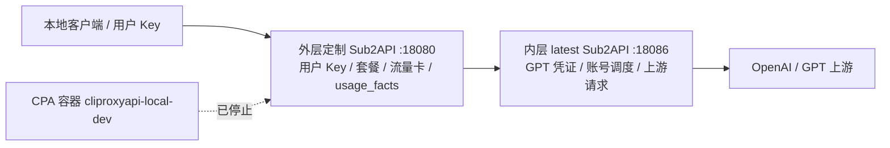

# 双 Sub2API 本地桥接结果

时间：2026-07-22 19:34

## 结果

- 已克隆 GitHub original/latest Sub2API 到 `D:\CodeWorkSpace\sub2api-upstream-latest`。
- latest 版本容器已本地运行：
  - `sub2api-upstream-latest`：`http://127.0.0.1:18086`
  - `sub2api-upstream-postgres`
  - `sub2api-upstream-redis`
- 已导入用户提供的 GPT/OpenAI agent identity 凭证到内层 latest。
- 内层 latest 已创建：
  - 分组：`internal-openai-upstream`
  - 上游账号：OpenAI OAuth / agent identity 凭证
  - 内部转发 Key：`outer-sub2api-forwarder`
- 内层直接验证：
  - `GET /v1/models` 返回 200。
  - `POST /v1/responses` 使用 `gpt-5.4-mini` 返回 200，输出 `ok`，响应含 usage。

## 外层切换

- 外层本地定制版新增 OpenAI APIKey 上游账号：
  - `id=2`
  - `name=sub2api-latest-openai-upstream`
  - `base_url=http://host.docker.internal:18086/v1`
  - `pool_mode=true`
  - 绑定所有本地 OpenAI 分组。
- 原 CPA 账号保留但已设为不可调度：
  - `id=1`
  - `name=cliproxy-local-openai`
  - `schedulable=false`
- 已重启外层本地容器 `sub2api-dev` 让调度快照重建。
- 已停止本地 CPA 容器：
  - `cliproxyapi-local-dev`：`Exited (0)`

## 端到端验证

- 外层本地入口 `http://127.0.0.1:18080`：
  - `GET /v1/models` 返回 200，模型数 13。
  - `POST /v1/responses` 返回 200，模型 `gpt-5.4-mini`，响应含 usage。
- 外层日志显示本次请求使用：
  - `api_key_id=173`
  - `account_id=2`
  - `group_id=2`
  - `status_code=200`
- 外层计费事实：
  - `usage_facts.id=14893`
  - `billing_status=settled`
  - `account_id=2`
  - `api_key_id=173`
- 外层扣费日志：
  - `usage_logs.id=172509`
  - `actual_cost=0.0007222500`
  - `requested_model=gpt-5.4-mini`
  - `inbound_endpoint=/v1/responses`
  - `upstream_endpoint=/v1/responses`

## 当前本地拓扑

## 回滚

1. 启动 `cliproxyapi-local-dev`。
2. 将 `cliproxy-local-openai` 恢复为 `schedulable=true`。
3. 将 `sub2api-latest-openai-upstream` 设为 `schedulable=false` 或移除其分组绑定。
4. 重启 `sub2api-dev` 或等待调度快照刷新。

## 边界

- 本轮只改本地开发运行态。
- 未触碰公网 Nginx、Cloudflare、公网数据库、公网容器。
- 未记录完整 GPT 凭证、JWT、内部 API Key。
